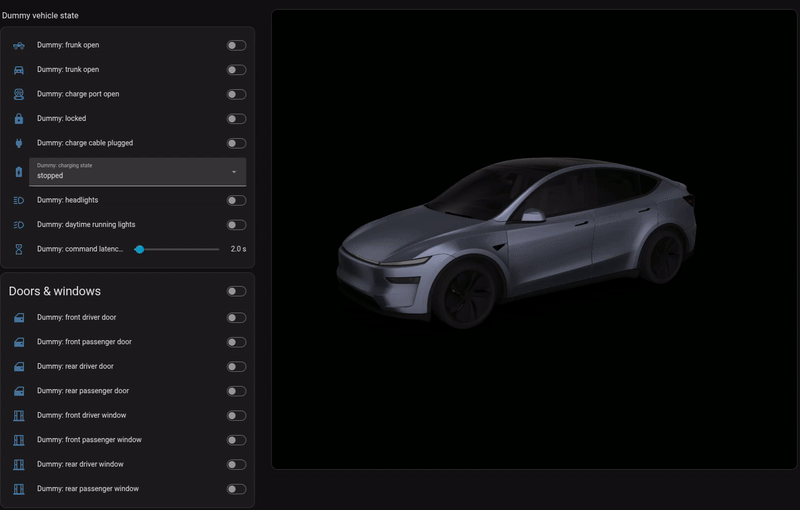
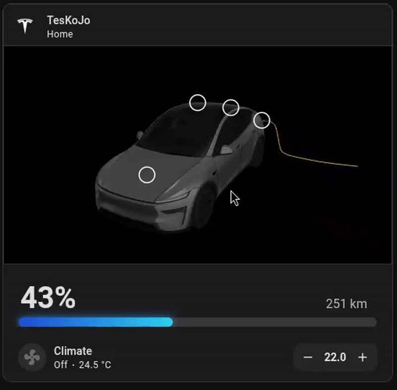
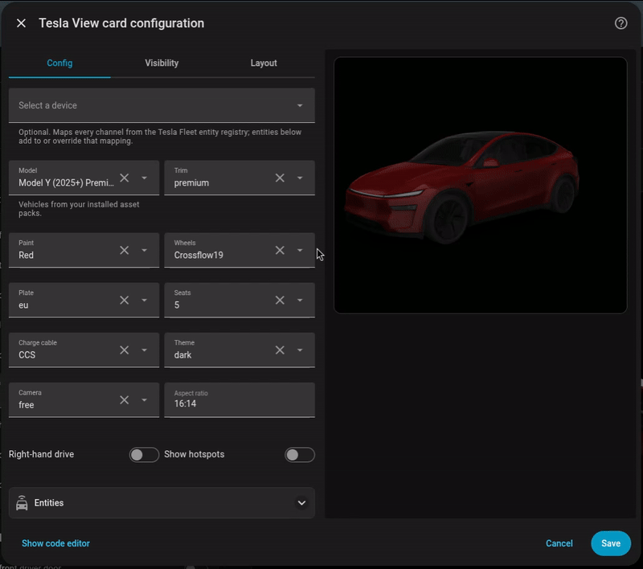

# Tesla View – Realtime interactive 3D Tesla card for Home Assistant

A Home Assistant custom integration + Lovelace card that shows your Tesla as an interactive 3D model rendered the way
the Tesla app renders it – same meshes, materials, animations and lighting – driven by your Home Assistant entities:
doors, windows, frunk, trunk, charge port, charge cable with charging flow, lock and lights. Hotspots on the car fire
real actions (open frunk/trunk, open/close charge port, lock/unlock, flash lights) through the Tesla Fleet integration
or any other entity you map (BLE, MQTT, …).



Or combine it with existing card and enable hot spots to control


The 3D assets are **not** included: they belong to Tesla and live inside the Tesla mobile app. You build an *asset
pack* from your own copy of the app with [tesla-view-extractor](https://github.com/koenhendriks/tesla-view-extractor)
and upload it once in Home Assistant. See [Asset pack](#asset-pack).

## Automatic mapping of entities

If you have the Tesla Fleet API enabled you can select this device to automatically sync all entity states to the 3D 
view. If you have your own entities (for instance from a BLE Proxy or a different API setup) you can map them to each
item in the 3D view as well.

## Visual Editor

This integration supports complete visual editor, there is no need to ever configure yaml files (but you can if you
really want to). The Tesla View supports anymodel the Tesla app support with complete support of configuration such as: 

- Color
- Wheels
- Charger Type
- License Plate type 



## Install

### HACS (recommended)

1. HACS → ⋮ → **Custom repositories** → add `https://github.com/koenhendriks/tesla-view`, category *Integration*.
2. Search for **Tesla View**, download it, restart Home Assistant.
3. Settings → Devices & services → **Add integration** → *Tesla View*. You can upload your asset pack right there.

Upgrading from a manual 0.1.x install? See [docs/migrating-from-0.1.md](docs/migrating-from-0.1.md).

### Manual

Download `tesla_view.zip` from the [latest release](https://github.com/koenhendriks/tesla-view/releases), unpack it into
`config/custom_components/tesla_view/`, restart, then add the integration as above.

The integration serves the card at `/tesla_view/…` and registers it as a dashboard resource (storage-mode dashboards; in
YAML mode add the resource printed in the log manually).

## Asset pack

Tesla View renders the car from the models, textures, animations and lighting the Tesla app ships. Because that
material is Tesla's, every user extracts it from their own copy of the app:

1. Get the Android bundle of the Tesla app (`Tesla_<version>.apks` / `.xapk` / `.apk`) from a device you own.
2. Run the extractor – Docker: `docker run --rm -v "$PWD":/work ghcr.io/koenhendriks/tesla-view-extractor /work/Tesla_4.60.0.apks`
   or `pip install tesla-view-extractor && tesla-view-extract Tesla_4.60.0.apks`. It lists the vehicles in the bundle
   (Model Y 2025+ Premium/Standard/L, Model Y 2020–24, Model 3 Highland, S/X, Cybertruck, …) and writes one zip per
   vehicle (≈ 20 MB).
3. Upload the zip in Home Assistant: **Settings → Devices & services → Tesla View → Configure → Upload asset pack**
   (also offered during setup and as a *Repairs* item while no pack is installed).

Packs are stored in `<config>/tesla_view/packs/` and survive integration updates. Upload another pack to add a second
vehicle or to replace one; *Configure → Remove* deletes a pack. Do not redistribute packs.

## Add the card

Pick **Tesla View** from the card picker: the visual editor lists the models, wheels, paints, camera presets and options
your packs provide, plus an *Entities* section with a picker per channel. Or use YAML:

```yaml
type: custom:tesla-view-card
device_id: <your Tesla Fleet vehicle device>   # entities are auto-mapped from this device
model: bayberry        # a model id from your pack (see the editor); default: the pack's default model
trim: premium          # premium | performance (when the model has a performance variant)
paint: Quicksilver     # paint name from the pack; default: the app's fallback paint
wheels: Crossflow19    # API wheel name from the pack; default: the model's default wheel
plate: eu              # eu | us
seats: 5               # 5 | 7 (when the model has a 7-seat variant)
cable: auto            # auto | CCS | EU | US … (charge cable model)
rhd: false             # right-hand drive interior
theme: auto            # auto (follows HA dark mode) | dark | light
background_dark: "#000000"   # optional: colour behind the car in dark mode (any CSS colour; default from the pack)
background_light: "#ffffff"  # optional: same for light mode
camera: parked         # parked | top_down | charging | drive | climate (presets from the pack) | free
aspect_ratio: "16:9"   # or height: 360
hotspots: true
```

### Mapping entities

With `device_id` the card reads the Tesla Fleet entity registry and maps every channel by its `translation_key`
(`vehicle_state_ft` → frunk, `vehicle_state_rt` → trunk, `charge_state_charge_port_door_open` → charge port,
`vehicle_state_locked` → lock, `vehicle_state_df/pf/dr/pr` → doors, `…_window` → windows, `charge_state_conn_charge_cable`
→ cable, `charge_state_charging_state` → charging, `flash_lights` → flash). Any channel can be pointed at any entity from
any integration instead – in the visual editor (*Entities* section) or in YAML – useful for local BLE data:

```yaml
entities:
  frunk: cover.model_y_frunk
  trunk: cover.model_y_trunk
  charge_port: cover.model_y_charge_port_door
  charge_cable: binary_sensor.ble_charge_cable_connected
  charging: sensor.model_y_charging          # charging|starting → flow, complete → solid, stopped|no_power → amber pulse
  lock: lock.model_y_lock
  door_fl: binary_sensor.model_y_front_driver_door      # door_fr door_rl door_rr, window_fl … window_rr
  headlights: binary_sensor.ble_headlights   # no Fleet equivalent – optional
  drl: …
  flash_lights: button.model_y_flash_lights
states:                                       # what counts as "on" / which enum values mean what (YAML only)
  headlights: { on: ["on", "true", "1"] }
  charging: { charging: [charging, starting], complete: [complete], stopped: [stopped, no_power] }
actions:                                      # override the service a hotspot calls (YAML only)
  trunk_open: { action: cover.open_cover, target: { entity_id: cover.model_y_trunk } }
  # keys: frunk_open trunk_open trunk_close charge_port_open charge_port_close lock unlock flash_lights
```

Default readers: `cover` open/opening → open, `lock` locked → locked, everything else `on`. Commands are shown
optimistically for up to 60 s until the entity confirms; failures (e.g. missing vehicle command key) show a toast. The
frunk can only be opened – the Tesla API has no close command, so its hotspot says so once open.

## How it works

The extractor recovers the Godot project embedded in the Tesla app and converts each vehicle scene into a GLB plus a
JSON description: per-surface materials, node transforms, closure animations, which nodes make up each light, where
the app's tap targets sit, and the app's studio lighting and camera presets. The card loads that description, applies
it to the GLB with three.js, reproduces the app's GLES2 gamma-space look (no tone mapping, raw textures, one studio
panorama for reflections and ambient) and drives node visibility and animations from your entities. Format reference:
[asset-pack-format.md](https://github.com/koenhendriks/tesla-view-extractor/blob/main/docs/asset-pack-format.md).

## Development

```bash
cd card && npm install
npm run dev:assets -- ../path/to/tesla-view-pack-bayberry.zip   # install a pack into the dev harness
npm run dev                                                      # http://127.0.0.1:5173/dev/index.html (mock hass)
npm run build                                                    # → custom_components/tesla_view/frontend/tesla-view-card.js
python3 tools/smoke-server.py                                    # built bundle under HA-like URLs
cd dev-hass && docker compose up -d && python3 setup.py --pack ../path/to/pack.zip   # a real Home Assistant with dummy entities
```

`dev-hass/` runs a throwaway Home Assistant with template entities shaped like the Tesla Fleet ones and two dashboards
(one wired to the card, one for the visual editor) – see [dev-hass/README.md](dev-hass/README.md). `AGENTS.md` holds the
working notes for contributors and AI agents.

Releases are tag-driven: bump the version in `custom_components/tesla_view/const.py`, `manifest.json` and
`card/package.json`, tag `vX.Y.Z`, and CI builds the card and attaches `tesla_view.zip` to the GitHub release.

## License and trademarks

Code: [MIT](LICENSE). This repository contains no Tesla material; see [NOTICE](NOTICE). Tesla, Model 3, Model S,
Model X, Model Y and Cybertruck are trademarks of Tesla, Inc. This project is not affiliated with or endorsed by Tesla.
